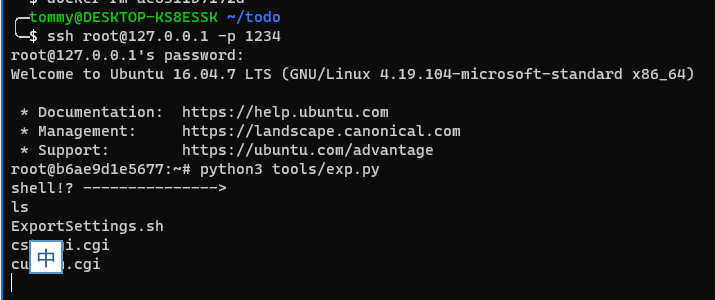

# TOTOLINK NR1800X 系列多个 CVE

这个固件太牛逼了，到处都是漏洞，发出来乐一乐，这里只展示最简单的两个命令注入与溢出漏洞。漏洞描述看参考链接： https://paper.seebug.org/1995/

## 漏洞环境

- docker：攻击、调试主机：192.168.2.1
- qemu-system：固件主机：192.168.2.2
- 镜像依赖：`firmianay/ubuntu1604 -> firmianay/qemu-system:mipsel`

使用 `firmianay/binwalk` 解压固件：

```sh
$ docker run --rm -v $PWD/firmware/:/root/firmware firmianay/binwalk -Mer "/root/firmware/TOTOLINK_NR1800X_B20210910_ALL.bin"
```

构建并启动漏洞环境：

```sh
# 初始化环境，需要先构建好qemu mipsel-system环境
$ ./init_env.sh mipsel

# 构建镜像
$ docker-compose -f docker-compose-system.yml build

# 启动容器
$ docker-compose -f docker-compose-system.yml up
# 等待出现下述输出，QEMU启动完成
# TOTO-system   | / # ./usr/sbin/lighttpd -f ./lighttp/lighttpd.conf
# TOTO-system   | / # 2022-11-08 13:09:06: (log.c.97) server started

# 启动完成后，开启 socks 代理
$ ssh -D 2345 root@127.0.0.1 -p 1234
# 配置浏览器代理，即可登陆 Web 后台 http://192.168.2.2/
# 漏洞利用(命令注入获得shell)，ssh后执行
$ python3 tools/exp.py
```




## GDB 调试

TODO GDB调试并添加一个bof利用示例

## 参考链接

- TOTOLINK NR1800X 系列 CVE 分析：https://paper.seebug.org/1995/
- TOTOLINK NR1800X系列cve：https://cve.mitre.org/cgi-bin/cvekey.cgi?keyword=TOTOLINK%20NR1800X
- 环境搭建usr模式和system模式，并绕过登录检测：https://bbs.pediy.com/thread-271765.htm
